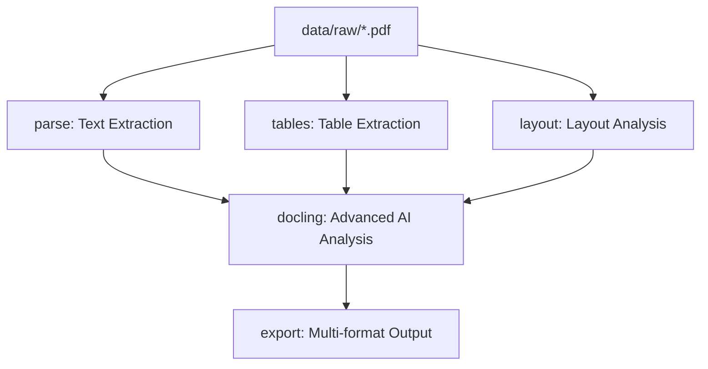

---

# 📄 Smart PDF Processing Pipeline with Dynamic DVC

**Team 5 – DAMG7245, Fall 2025**

A **production-ready, self-configuring** pipeline that extracts **text, tables, layout, metadata** (and optionally **Google Document AI**) from PDFs. Uses **DVC** for reproducible orchestration and a **smart setup** that adapts to your Python (3.7–3.12) and platform.

---

## 🧭 Table of Contents

* [🚀 One-Command Setup](#-one-command-setup)
* [🔧 System Requirements](#-system-requirements)
* [⚡ Quick Start](#-quick-start)
* [🛠️ Advanced Setup](#️-advanced-setup)
* [📊 DVC Pipeline Usage](#-dvc-pipeline-usage)
* [🏗️ Project Structure](#️-project-structure)
* [🔬 Pipeline Labs](#-pipeline-labs)
* [🤖 Lab 7: Google Document AI (Optional)](#-lab-7-google-document-ai-optional)
* [📤 Output Structure](#-output-structure)
* [🧩 Troubleshooting](#-troubleshooting)
* [⚡ Performance](#-performance)
* [👥 Team](#-team)
* [📝 License](#-license)

---

## 🚀 One-Command Setup

Works with **any Python 3.7+** (auto-adapts to 3.7–3.12):

```bash
git clone https://github.com/Big-Data-IA-Team-5/Assignment-1---DAMG7245-Team-5.git
cd Assignment-1---DAMG7245-Team-5

# Smart, cross-platform bootstrap
python3 setup/smart_setup.py

# Activate and run
source activate.sh            # Windows: activate.bat
dvc repro
```

**What the smart setup does**

* ✅ Detects Python version and OS
* ✅ Creates virtual env and pins compatible dependencies
* ✅ Initializes DVC (if needed)
* ✅ Generates activation scripts for your OS

---

## 🔧 System Requirements

* **Python**: 3.7+ (3.10–3.12 recommended)
* **RAM**: 4 GB minimum (8 GB+ for long PDFs)
* **Disk**: 2 GB free
* **OS**: Windows / macOS / Linux
* **Optional**:

  * **Tesseract OCR** (auto-detected if installed)
  * **Java** (for some Camelot backends)
  * **Google Document AI** creds for Lab 7

**System packages**

* macOS: `brew install tesseract` (and `xcode-select --install`)
* Ubuntu/Debian: `sudo apt-get install -y tesseract-ocr libtesseract-dev build-essential`
* Windows: Install [Tesseract OCR (UB Mannheim build)](https://github.com/UB-Mannheim/tesseract/wiki) and add to `PATH`.

---

## ⚡ Quick Start

### Option A — Smart (Recommended)

```bash
python3 setup/smart_setup.py                  # auto setup
python3 setup/smart_setup.py --minimal        # essential deps only
python3 setup/smart_setup.py --force-reinstall
python3 setup/smart_setup.py --skip-dvc
```

### Option B — Traditional

```bash
python3 -m venv .venv
source .venv/bin/activate                     # Windows: .venv\Scripts\activate
pip install -r setup/requirements.txt         # dynamic, version-aware
```

### Option C — Shell Script (Unix/macOS)

```bash
chmod +x setup/setup_smart.sh
./setup/setup_smart.sh
```

**Verify**

```bash
python3 setup/verify_setup.py
```

---

## 🛠️ Advanced Setup

**Dynamic requirements (auto-selects versions by Python runtime)**

* `setup/requirements.txt` – dynamic, recommended
* `setup/requirements-minimal.txt` – lean install
* `requirements/` – pinned/constraints by family

**Manual switches**

```bash
source .venv/bin/activate
pip install -r setup/requirements-minimal.txt
pip install -r setup/requirements.txt
```

---

## 📊 DVC Pipeline Usage

**Why DVC?** Reproducible runs, clear DAGs, cache, and collaboration.

### Pipeline Overview



### Essential Commands

```bash
source activate.sh                   # Windows: activate.bat
dvc status                           # what will run
dvc repro                            # run full pipeline
dvc repro parse                      # run a specific stage
dvc repro tables
dvc repro layout
dvc dag                              # visualize pipeline DAG
dvc pipeline show                    # detailed view
# If remote configured:
dvc push | dvc pull
```

---

## 🏗️ Project Structure

```
Assignment-1---DAMG7245-Team-5/
├─ README.md
├─ dvc.yaml / dvc.lock
├─ run_complete_pipeline.py                 # orchestrates Labs 1–6
├─ activate.sh / activate.bat               # env activation
│
├─ setup/
│  ├─ smart_setup.py                        # dynamic installer
│  ├─ verify_setup.py
│  ├─ requirements.txt                      # dynamic
│  └─ requirements-minimal.txt
│
├─ dvc/
│  ├─ dvc_pipeline_setup.py
│  └─ dvc_utils.py
│
├─ data/
│  ├─ raw.dvc                               # DVC-tracked PDFs
│  ├─ raw/                                  # drop PDFs here
│  ├─ intermediate/
│  │  ├─ text/  ├─ tables/  └─ layout/
│  └─ parsed/                               # final outputs
│
├─ src/
│  ├─ text/       # Lab 1
│  ├─ tables/     # Lab 2 (extract_tables.py)
│  ├─ layout/     # Lab 3
│  ├─ docling/    # Lab 4
│  ├─ metadata/   # Lab 5
│  └─ formats/    # Lab 6
│
├─ google_ai/                               # Lab 7 (optional)
├─ credentials/                             # (gitignored) keys
├─ reports/
├─ configs/
├─ utils/
├─ tests/
└─ .dvc/
```

---

## 🔬 Pipeline Labs

| Lab       | Purpose                                 | Outputs                    | Status     |
| --------- | --------------------------------------- | -------------------------- | ---------- |
| **Lab 1** | Text extraction (OCR fallback)          | `.txt`, per-page           | ✅ Working  |
| **Lab 2** | Table extraction (Camelot + PDFPlumber) | `.csv`, index + analysis   | ✅ Working  |
| **Lab 3** | Layout analysis                         | `layout_*.json`            | ✅ Working  |
| **Lab 4** | Docling AI processing                   | `.json`, `.md`             | ✅ Working  |
| **Lab 5** | Metadata & provenance                   | `.jsonl`, `.md`, summaries | ✅ Working  |
| **Lab 6** | Multi-format export                     | Markdown / JSON / TXT      | ✅ Working  |
| **Lab 7** | Google Document AI (optional)           | AI extracts + comparison   | ✅ Optional |

**Manual execution (alternative to DVC):**

```bash
python3 run_complete_pipeline.py --out data/parsed --hybrid-tables --verbose

# Individual labs
python3 src/text/extract_text.py      --in data/raw/your.pdf --out data/parsed/
python3 src/tables/extract_tables.py  --in data/raw/your.pdf --out data/parsed/ --hybrid
python3 src/layout/extract_layout.py  --in data/raw/your.pdf --out data/parsed/
python3 src/docling/extract_docling.py --in data/raw/your.pdf --out data/parsed/
python3 src/metadata/extract_metadata.py --in data/raw/your.pdf --out data/parsed/
python3 src/formats/convert_formats.py --in data/parsed/<doc>/metadata/<doc>.jsonl --out data/parsed/<doc>/
```

---

## 🤖 Lab 7: Google Document AI (Optional)

**What it adds**

* AI-powered extraction: text, tables, entities, forms
* Smart page selection (random/sample or explicit pages)
* Side-by-side comparison with Labs 1–6
* Clean reports under `reports/google_ai/`

**Setup**

1. Place service account JSON at `credentials/google-credentials.json`
2. Update `configs/google_ai_config.json` (processor ID, project, location)
3. (Optional) export:

   ```bash
   export GOOGLE_APPLICATION_CREDENTIALS="credentials/google-credentials.json"
   ```

**Usage**

```bash
# Random N pages
python3 google_ai/run_lab7.py --pdf data/raw/tesla.pdf --random 2

# Specific pages
python3 google_ai/run_lab7.py --pdf data/raw/tesla.pdf --pages 5 12
```

---

## 📤 Output Structure

### Main pipeline

```
data/parsed/
└─ <your_document>_<timestamp>/
   ├─ text/
   ├─ tables/
   │  ├─ *_p<page>_t<table>.csv
   │  ├─ _comprehensive_index.csv
   │  └─ _comprehensive_analysis.json
   ├─ layout/
   ├─ docling/
   ├─ metadata/
   └─ formats/
LANTERN_Pipeline_Report_<timestamp>.md
pipeline_summary_<timestamp>.json
```

### Lab 7 (Google AI)

```
reports/google_ai/lab7_session_<timestamp>/
├─ temp_pdfs/
├─ raw_google_ai_results/
├─ parsed_results/
├─ parsed_data_comparison/
└─ final_reports/
```

---

## 🧩 Troubleshooting

### Environment

```bash
source .venv/bin/activate                 # ensure venv is active
pip install --upgrade pip setuptools wheel
pip install -r setup/requirements.txt
python3 setup/verify_setup.py
```

### Python version

* Supported: **3.7–3.12** (auto-adapted)
* Recommended: **3.10–3.12**
* Check: `python3 --version`

### System deps

* Tesseract not found → install (see requirements) and ensure it’s on `PATH`.
* Java not found → some Camelot backends may require Java for best results.

### DVC

```bash
dvc init                 # if repo not initialized
dvc status
dvc repro --verbose
dvc cache dir            # inspect cache
dvc repair               # repair corrupted cache
```

### Files & permissions (Unix/macOS)

```bash
chmod +x run_complete_pipeline.py setup/smart_setup.py setup/setup_smart.sh
```

### Logs & monitoring

```bash
tail -f pipeline_execution.log
tail -f lab7_execution.log
dvc repro --verbose
```

**Common Errors**

| Error                 | Fix                                         |
| --------------------- | ------------------------------------------- |
| `ModuleNotFoundError` | Activate venv; reinstall requirements       |
| `Tesseract not found` | Install Tesseract; add to `PATH`            |
| `DVC pipeline failed` | `dvc status` → fix missing deps/inputs      |
| `Permission denied`   | `chmod +x` the script                       |
| `PDF not found`       | Place PDFs under `data/raw/` or update path |

---

## ⚡ Performance (Typical)

* **100-page PDF**: ~4–6 minutes, ~4 GB RAM
* **Lab 7** (2 pages): ~3–5 seconds, ~2 GB RAM
* Timestamped outputs for traceability and reproducibility

---

## 👥 Team

**Team 5 – DAMG7245 (Fall 2025)**
Big Data Analytics Project – SEC Filing Processing Pipeline
Lab 7 contributors: Google Document AI integration, page selection, AI analysis, security, testing.

---

## 📝 License

**MIT License** – see project files for details.

---

### 🔎 Quick Reference

**Setup & Verify**

```bash
python3 setup/smart_setup.py
python3 setup/verify_setup.py
```

**DVC Ops via Utils (optional)**

```bash
python dvc/dvc_utils.py status
python dvc/dvc_utils.py run
```

**Run Main Pipeline**

```bash
python run_complete_pipeline.py
dvc repro
```

---

